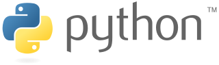

# Python Esencial

## Curso

Curso vinculado a los ejemplos de este repositorio: https://www.linkedin.com/learning/python-esencial-15349768

## Pyenv

Pyenv es una herrramienta que te permite instalar diferentes versiones de Python y cambiar entre ellas según las necesidades del proyecto.

https://www.netinetidesign.com/post/python-pyenv-y-pipenv-en-mac/

## Virtualenv

Virtualenv es una herramienta que permite generar entornos aislados para tu proyecto.

https://sourabhbajaj.com/mac-setup/Python/virtualenv.html
